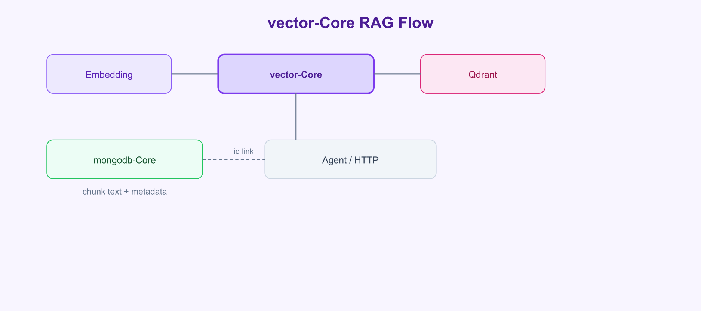
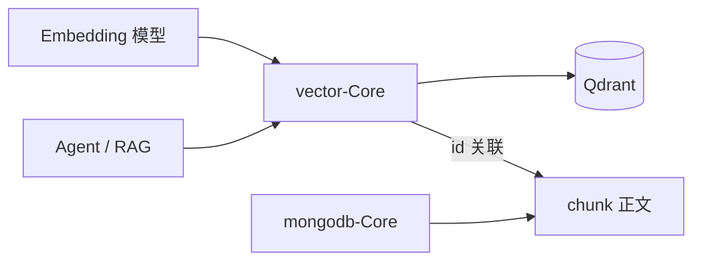

<div align="center">

<br>

# 🔮 vector-Core

**向量检索层 · Qdrant · 集合注册 · 写入 · 相似度搜索 · 管理 API**

<sub>XRK-AGT 业务 Core · 安装于宿主 `core/vector-Core`</sub>

<br>

[](https://github.com/sunflowermm/XRK-AGT)
[](https://qdrant.tech/)

<br>

[安装](#安装) · [架构](#架构) · [API](#api-文档) · [快速开始](#快速开始) · [配置](#配置) · [HTTP](#http-api) · [约定](#开发约定)

<br>

</div>

---

## 概述

vector-Core 为 XRK-AGT 提供基于 Qdrant 的向量集合管理、写入与相似度检索，适用于 RAG 召回、语义搜索等场景。与 mongodb-Core / postgres-Core 并行部署，各自独立连接。

| 项 | 说明 |
|---|---|
| 向量引擎 | [Qdrant](https://qdrant.tech/)（REST，默认 `6333`） |
| 安装路径 | `core/vector-Core/` |
| 依赖 | 无额外 npm 包（使用 Node 原生 `fetch`） |
| 典型组合 | 向量存 Qdrant，chunk 正文存 MongoDB |

---

## 安装

```bash
cd XRK-AGT/core
git clone https://github.com/sunflowermm/vector-Core.git vector-Core
cd ..
node app
```

部署 Qdrant（示例 Docker）：

```bash
docker run -p 6333:6333 qdrant/qdrant
```

配置写入 `data/vector-core/config.yaml`（首次从 `default/vector-core.yaml` 引导）。

---

## 架构





---

## API 文档

详见 **[`docs/API.md`](./docs/API.md)**。

| API | 说明 |
|---|---|
| `registerVectorCollection(owner, entity, { dimension })` | 注册向量集合 |
| `VectorRepository` | upsert / search / delete |
| `ensureCollections()` | 在 Qdrant 创建集合 |
| `VectorService` | 全局服务入口 |

---

## 快速开始

```javascript
import { registerVectorCollection, VectorRepository } from '../../../vector-Core/lib/index.js';

const DOCS = registerVectorCollection('rag', 'docs', {
  dimension: 1536,
  distance: 'Cosine',
});

export class DocVectorRepo extends VectorRepository {
  constructor() {
    super(DOCS);
  }

  async indexDocument(id, embedding, meta) {
    return this.upsert([{ id, vector: embedding, payload: meta }]);
  }

  async query(embedding, topK = 8) {
    const hits = await this.search(embedding, { limit: topK });
    return hits.map((h) => ({
      id: h.id,
      score: h.score,
      payload: h.payload,
    }));
  }
}
```

`dimension` 必须与所用 Embedding 模型输出维度一致。

---

## 配置

| 字段 | 默认 | 说明 |
|---|---|---|
| `connection.host` | `127.0.0.1` | Qdrant 主机 |
| `connection.port` | `6333` | REST 端口 |
| `connection.apiKey` | 空 | 可选鉴权 |
| `ensureCollectionsOnBoot` | `true` | 启动创建声明集合 |
| `defaultSearchLimit` | `10` | 默认 top-K |

---

## HTTP API

| 方法 | 路径 | 响应 |
|---|---|---|
| `GET` | `/api/vector-core/health` | 连接与迁移状态 |
| `GET` | `/api/vector-core/collections` | 已注册集合 |
| `GET` | `/api/vector-core/admin/stats` | 各集合向量点数 |

---

## 开发约定

1. 向量集合经 `registerVectorCollection` 注册，命名 `<core>_<entity>`。
2. 完整文本与业务字段写入 mongodb-Core 或 postgres-Core；Qdrant payload 仅放检索所需字段。
3. 检索使用 `VectorRepository.search`，超时由配置 `timeoutMs` 控制。
4. 与 system-Core `database` stream（本地文件知识库）职责分离：后者面向 Agent 文件 RAG，本 Core 面向可扩展向量服务。

---

## 相关 Core

| Core | 场景 |
|---|---|
| [mongodb-Core](https://github.com/sunflowermm/mongodb-Core) | 文档与 chunk 存储 |
| [postgres-Core](https://github.com/sunflowermm/postgres-Core) | 结构化数据 |
| vector-Core | 向量相似检索 |

---

## 链接

- [API 参考](./docs/API.md)
- [Qdrant 文档](https://qdrant.tech/documentation/)
- [AGENTS.md](./AGENTS.md)
